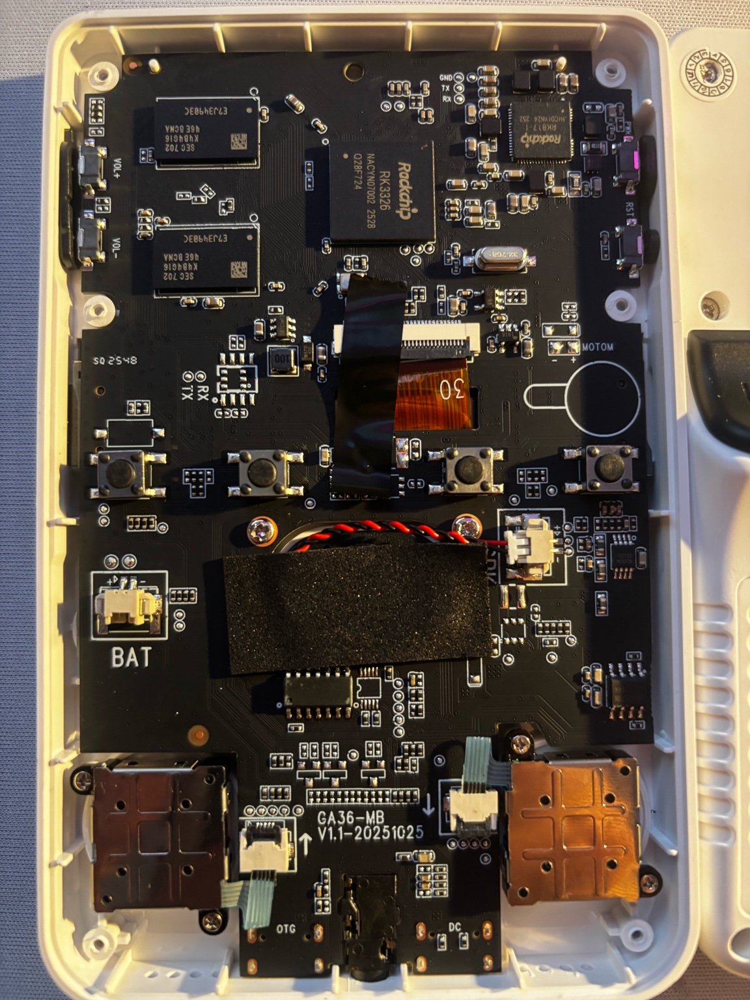

# R36S Clone – GA36-MB V1.1–20251025 · EmuELEC 4.7 (128GB SD Card Backup)

This repository contains a **full backup of the original SD card** from an **R36S Clone** console with **GA36-MB V1.1-20251025**, running **EmuELEC 4.7**.

Its purpose is to help anyone who has **broken, lost, or corrupted the original SD card** and needs to restore the console to a working state.

---

## ⚠️ IMPORTANT

- This is **NOT a modified firmware**
- This is an **exact image of the original SD card**
- Compatible **ONLY** with:
  - **R36S Clone**
  - **Motherboard: GA36-MB V1.1**
  - **EmuELEC 4.7**

If your console uses a different board or firmware version, **do NOT use this image**.

---

## 🧩 Supported Hardware (Important)

This backup is intended **ONLY** for R36S Clone consoles using the **GA36-MB V1.1** motherboard.

Please verify your board before using this image.

Board identification details:
- PCB marking: **GA36-MB**
- Version: **V1.1**
- Date code: **20251025**
- SoC: **Rockchip RK3326**

---

## 💾 Recommended SD Card (VERY IMPORTANT)

It is **strongly recommended** to use:

- **128 GB SD card**
- **Reliable brand**
- **High endurance / high quality**

### ✔ Personal recommendation
- **SanDisk High Endurance 128 GB**

Why:
- Much better durability
- Lower risk of corruption
- Far more reliable than the generic SD cards shipped with these consoles

⚠️ Using 64 GB cards or generic brands is **not recommended**.

---

## Download (100% Free)

The compressed backup is ~68 GB.
To keep this project completely free, the archive is split into multiple
parts and hosted on free cloud services.

All parts are required.

Download:
- Part 1 (.001) – InfiniCLOUD: *(pending)*
- Part 2 (.002) – InfiniCLOUD: *(pending)*
- Part 3 (.003) – MEGA: *(pending)*
- Part 4 (.004) – MEGA: [Download](https://mega.nz/file/fw4hEBJJ#C7o9uYRlXFD6oYnO7Pe3cxMB8EYuvUxs53BA1hYCR5o)
- Part 5 (.005) – MEGA: [Download](https://mega.nz/file/SsYnVbhD#l47yUtr7aVzVffT6rBcucJRy4TzmLEZhb-jQHT0fcCI)

How to extract:
1. Download ALL parts
2. Place them in the same folder
3. Right-click on `.7z.001` → Extract here

### Integrity check (SHA256)

File:
R36S_GA36-MB_V1.1_EmuELEC_4.7.7z

SHA256:
953c9aad0ccbea4ab9f0eb86cae7f2933263ad34a2934c21c8bd4b1304c724da

NOTE: If the SHA256 hash matches, the file is confirmed to be complete and unmodified.

---

## 🧰 How to restore the image (Windows)

You can use **DiskGenius** or **Rufus**. Both work perfectly.

---

## 🔹 Method 1: DiskGenius (recommended)

1. Download and install **DiskGenius**
2. Insert the SD card into your PC
3. Run DiskGenius **as Administrator**
4. Go to:
   - `Tools` → `Write Image To Disk`
5. Select the backup `.img` file
6. Carefully select the correct SD card (**double-check this**)
7. Click **Start**
8. Wait until the process finishes (it may take several minutes)
9. Safely eject the SD card
10. Insert the SD card into the console and power it on

---

## 🔹 Method 2: Rufus

1. Download **Rufus**
2. Insert the SD card into your PC
3. Open Rufus
4. Under **Device**, select the correct SD card
5. Under **Boot selection**, click **SELECT**
6. Choose the backup `.img` file
7. Rufus will automatically detect the correct mode
8. Click **START**
9. Accept the warnings
10. When finished, safely eject the SD card and insert it into the console

---

## 🚀 First boot

- The **first boot may take longer than usual**
- EmuELEC may automatically resize partitions
- **Do not power off the console during this process**

---

## 🛑 Common issues

- **Black screen** → Wrong SD card or incompatible console
- **Does not boot** → Defective SD card or bad write process
- **Boots but crashes** → Use a higher-quality SD card

---

## 📌 Legal notice

This backup is provided **as-is**, without any guarantees, and for **preservation and recovery purposes only**.  
No copyrighted content is intentionally distributed or promoted.

---

## 🤝 Contributions

If you have:
- Another compatible backup
- Additional technical information
- Documentation improvements

Feel free to contribute.

---

## ⭐ If this repository helped you

Please leave a star ⭐ so others can find it more easily.
